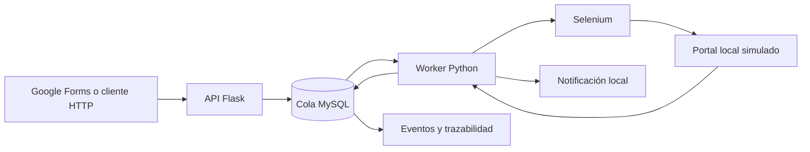
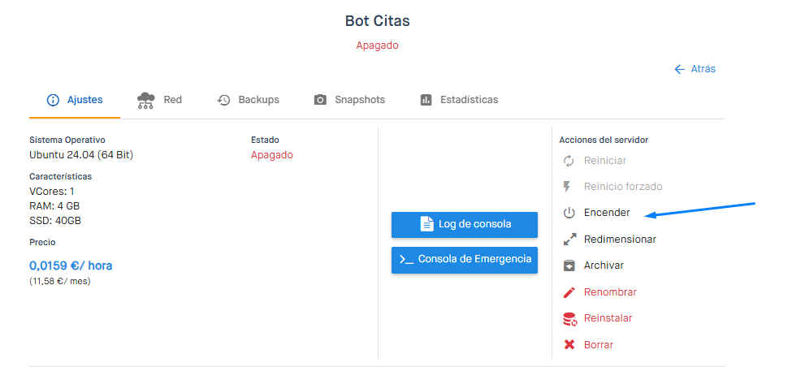

<p align="center">
  
</p>

<h1 align="center">CitaBot</h1>

<p align="center">
  Automatización de solicitudes y programación simulada de citas web.
</p>

<p align="center">
  
  
  
  
  
</p>

## ¿Qué problema resuelve?

Cuando las solicitudes llegan por distintos medios, revisar disponibilidad,
procesarlas una por una y comunicar el resultado puede convertirse en una tarea
repetitiva y difícil de controlar. CitaBot centraliza ese recorrido: recibe la
solicitud, la registra, ejecuta el proceso de forma secuencial y conserva el
estado de cada operación.

Es un proyecto independiente que demuestra cómo convertir un proceso manual en
un flujo automatizado, trazable y desplegable. La edición pública reemplaza la
plataforma original por un portal local simulado, por lo que puede revisarse sin
cuentas reales ni dependencia de servicios externos.

## Funcionalidades principales

- Recepción de solicitudes mediante una API Flask protegida con token local.
- Validación de datos y rechazo explícito de contraseñas de terceros.
- Cola persistente en MySQL con procesamiento secuencial.
- Estados `PENDING`, `PROCESSING`, `COMPLETED`, `FAILED` y `CANCELLED`.
- Automatización con Selenium sobre un portal local incluido en el proyecto.
- Reintentos limitados, control de cancelación y registro de eventos.
- Integración opcional con Google Forms mediante Apps Script.
- Notificación local del resultado y trazabilidad del proceso.

## Tecnologías

**Backend y automatización**


**Datos e integración**


**Infraestructura y calidad**


## Cómo funciona



1. La API recibe una solicitud ficticia con correo de contacto y rango de fechas.
2. MySQL la registra como `PENDING`.
3. El worker toma una única solicitud y la cambia a `PROCESSING`.
4. Selenium consulta y selecciona una fecha en el portal local simulado.
5. El sistema vuelve a comprobar si la solicitud fue cancelada antes de confirmar.
6. El resultado y sus eventos quedan registrados para consulta posterior.

La solución separa API, dominio, persistencia, procesamiento, automatización y
notificaciones. El detalle se encuentra en la
[documentación de arquitectura](docs/ARCHITECTURE.md).

## Puesta en marcha

### Requisitos

- Python 3.11 o superior.
- Docker y Docker Compose.
- Google Chrome.

### Instalación

```bash
git clone https://github.com/HectorMontenegro/sistema-citas-demo.git
cd sistema-citas-demo
cp .env.example .env
docker compose up -d mysql
python -m venv .venv
python -m pip install -e ".[dev]"
```

Completa los valores `CHANGE_ME` de `.env` con datos locales. Después inicia la
API y el portal simulado:

```bash
python -m appointment_demo.api
```

Registra una solicitud de prueba:

```bash
curl -X POST http://127.0.0.1:5000/api/requests \
  -H "Content-Type: application/json" \
  -H "X-Demo-Token: TU_TOKEN_LOCAL" \
  -d '{"contact_email":"demo@example.test","preferred_from":"2026-09-01","preferred_to":"2026-11-30"}'
```

Finalmente, ejecuta una iteración del worker:

```bash
python -m appointment_demo.worker --once
```

## Despliegue del prototipo

El prototipo original se ejecutó de manera continua en un servidor Linux de
Clouding.io. La captura documenta la experiencia de configuración y operación
de infraestructura; el servidor mostrado está desactivado y la edición pública
se ejecuta en un entorno local simulado.

<p align="center">
  
</p>

## Calidad y seguridad

```bash
pytest
ruff check .
ruff format --check .
bandit -r src
```

- 14 pruebas automatizadas aprobadas.
- Ruff sin errores de estilo o formato.
- Bandit sin vulnerabilidades detectadas en `src`.
- Escaneo de secretos sin credenciales encontradas.

La edición pública no incluye direcciones, selectores, credenciales, cookies ni
sesiones de plataformas externas. Selenium rechaza cualquier destino distinto
de loopback y las notificaciones se registran localmente, sin envío SMTP real.
Consulta [uso y límites](ETHICAL_USE.md) y [seguridad](SECURITY.md).

## Estructura

```text
sistema-citas-demo/
├── src/appointment_demo/     # API, dominio, persistencia, worker y Selenium
├── sql/schema.sql            # Cola, estados y auditoría
├── google_apps_script/       # Integración opcional con Google Forms
├── tests/                    # Pruebas de API, servicio y publicación segura
├── docs/                     # Arquitectura y evidencias visuales
├── docker-compose.yml        # MySQL reproducible
└── .github/workflows/        # Validación automática del proyecto
```

## Próximas mejoras

- Panel local para consultar solicitudes y eventos.
- Métricas de tiempos, reintentos y resultados.
- Pruebas de integración automatizadas con MySQL y Chrome.
- Autenticación para operar únicamente sobre sistemas propios o autorizados.

## Autor

**Hector Samir Montenegro Villalobos**<br>
Estudiante de Ingeniería de Sistemas interesado en desarrollo de software,
automatización de procesos y arquitectura de soluciones.

Este repositorio es una adaptación pública para portafolio. No representa un
servicio activo de citas ni una afiliación con plataformas externas.
